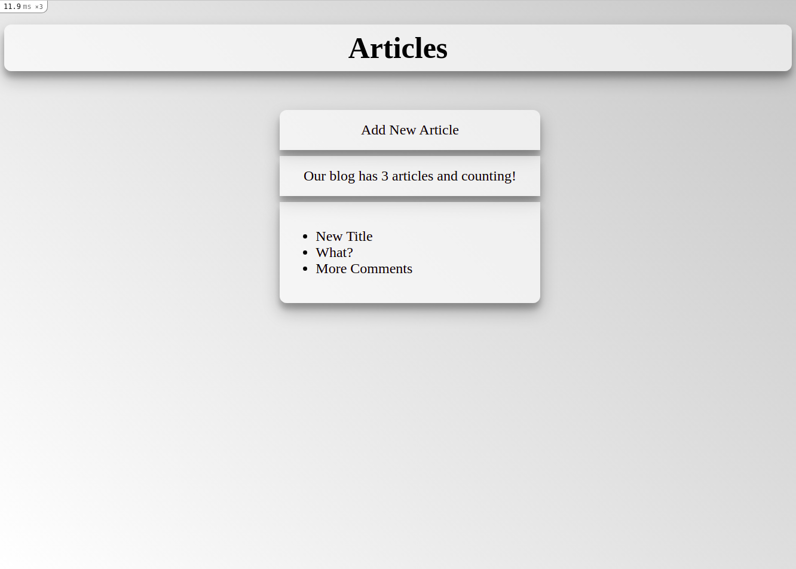
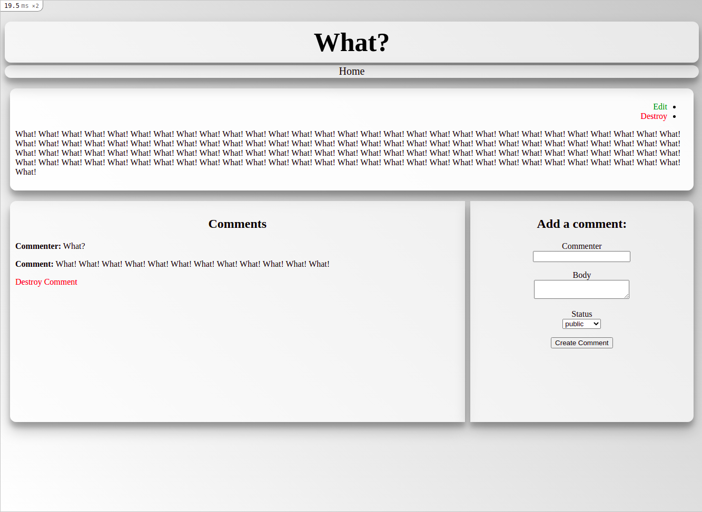
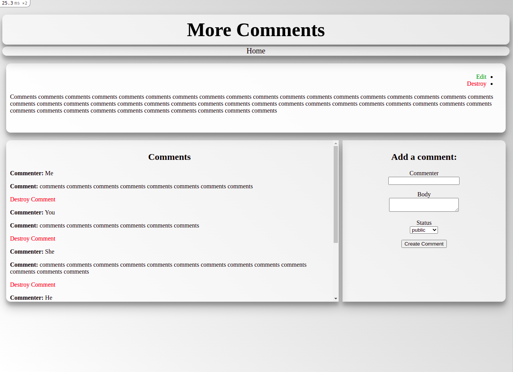

## Project - "Blog" by course The Odin Project
**Simple "*Blog*"**

The main point is to learn more about the principles of working with Ruby on Rails

- Ruby v2.7.2
- Ruby On Rails v6.1.4
- CSS
- SASS
- SQL Database

